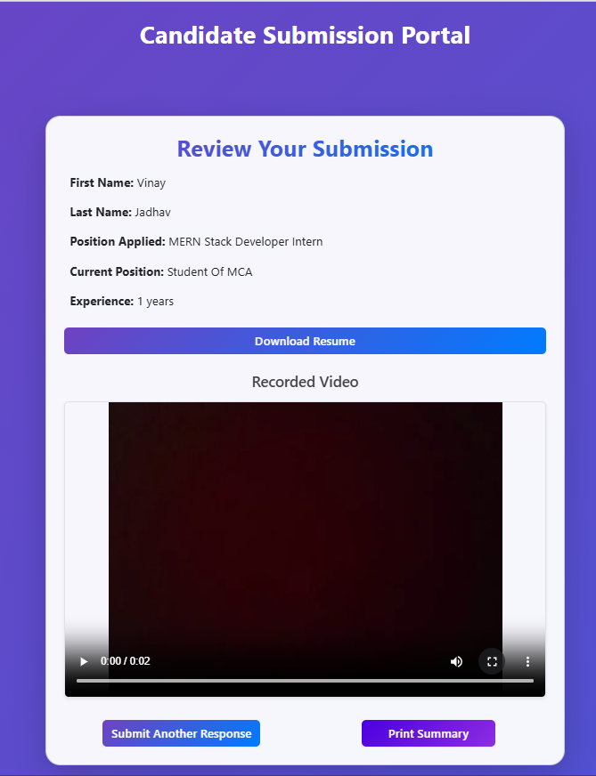

# Candidate Information & Video Submission Portal

A full-stack MERN application for candidates to submit personal information, upload resumes, record short videos, and review submissions.

---
## 💻 Tech Stack

**Frontend:**

| Logo | Technology | Description |
|------|-----------|-------------|
|  | React | Building UI components |
|  | Bootstrap | Responsive styling |
|  | Framer Motion | Smooth animations & interactive effects |
|  | MediaRecorder API | Capture video in-browser |

**Backend:**

| Logo | Technology | Description |
|------|-----------|-------------|
|  | Node.js + Express | Server & API |
|  | Multer | Handle PDF uploads (≤5 MB) |
|  | MongoDB | Data storage |
|  | GridFS | Store video files (≤90 seconds) |


---

⚠️ **Notes**
- Resume uploads must be PDF and ≤ 5 MB
- Video recordings must be ≤ 90 seconds
- Ensure camera and microphone permissions are granted for video recording

---

## 🚀 Getting Started

1. Clone the repository:
```bash
git clone https://github.com/VinayJadhav163/mern-assignment-spurqlabs.git
```
---

2.Install dependencies for frontend and backend:
```bash
cd frontend
npm install
cd ../backend
npm install
```
---
3.Start the backend server:
```bash
   npm start
```
---

4.Install frontend dependencies:
```bash
   cd ../frontend
   npm install
```

---

5.Start the frontend app:
```bash
   npm start
```

---
6. Open the portal in your browser at http://localhost:3000
---

📁 Folder Structure
```bash

mern-assignment-spurqlabs/
├── backend/            # Node.js + Express backend
├── frontend/           # React frontend
├── screenshots/        # Images for README
├── .gitignore
├── package.json
└── README.md
```
---
📝 Project Features
### 1. Candidate Information Form
- **Fields:**
  - First Name
  - Last Name
  - Position Applied For
  - Current Position
  - Experience (Years)
- **Resume Upload:** PDF only, ≤ 5 MB
- **Validation:**
  - All fields are required
  - Show error messages if any field is missing or invalid
- **Next Button:** Proceeds to video recording instructions

---

### 2. Video Recording Instructions
- **Topics to Cover:**
  - Why you are interested in this position
  - Highlight relevant experience
  - Long-term career goals
- **Video Recording Features:**
  - Start/Stop buttons
  - Timer (≤ 90 seconds)
  - Live video preview
- **Submit Button:** Proceeds to the review page
- **Validation:** Show an error if video exceeds 90 seconds

---

### 3. Review Information and Video
- **Display Candidate Details:**
  - First Name
  - Last Name
  - Position Applied For
  - Current Position
  - Experience
- **Resume & Video:**
  - Downloadable resume
  - Embedded video playback

---

## 📸 Screenshots 

### Candidate Information Form

*Fill out your details and upload your resume.*

### Video Recording Instructions

*Record a short video introduction (≤ 90 seconds).*

### Review Submission Page



*Review your entered details, download your resume, and play your recorded video.*

---
🙏 Acknowledgements

Thanks to SpurQ Labs for providing the assignment and opportunity to build this full-stack MERN application.
---


